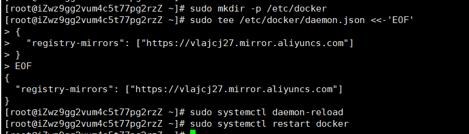
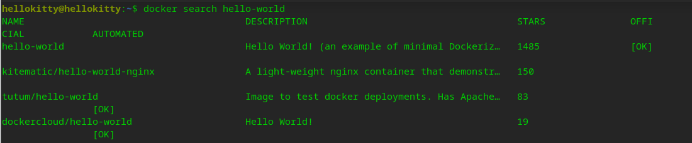

# Docker学习笔记

## 一、Docker概述

[(3条消息) Docker 从入门到实践系列一 - 什么是Docker_ThinkWon的博客-CSDN博客_什么是docker](https://thinkwon.blog.csdn.net/article/details/107477065)

## 二、Docker安装（deepin环境下）

### 2.1、安装步骤

```shell
# 1. 确保卸载以前系统中可能已有的老版本docker
sudo apt-get remove docker.io docker-engine

# 2. 安装docker-ce与密钥管理与下载相关的工具
sudo apt-get install apt-transport-https ca-certificates curl python-software-properties software-properties-common
# 执行第二步这个命令可能会出错，这时候不要慌，执行一下sudo apt-get update 命令更新下本地软件包索引，然后重新执行第二步的安装命令即可

# 3. 下载并安装密钥
curl -fsSL https://download.docker.com/linux/debian/gpg | sudo apt-key add -
# 第三步也可能出错，因为使用了外国的镜像，可能下载慢或者下载不了，需要“翻墙”，如果你翻不了，就将第三步的命令换成下面这个命令，使用国内的镜像
curl -fsSL https://mirrors.ustc.edu.cn/docker-ce/linux/debian/gpg | sudo apt-key add -
# 执行完，你可以通过sudo apt-key fingerprint 0EBFCD88验证秘钥是否安装成功

#  4. 添加docker官方仓库
sudo add-apt-repository  "deb [arch=amd64] https://download.docker.com/linux/debian jessie stable"
#  同样的，第四步的命令也可能出错，原因还是“翻墙”哦，不急，换上国内的
sudo add-apt-repository "deb [arch=amd64] https://mirrors.ustc.edu.cn/docker-ce/linux/debian jessie stable"
# 这时候，你可能又会出现一个错误：add-apt-repository：找不到命令  不要慌，依次执行下面这些命令
sudo apt-get install python-software-properties
sudo apt-get update
sudo apt install software-properties-common 
sudo apt-get update
#  执行完上面四个命令之后，你再去执行第四步的命令就ok了

# 5. 安装docker-ce
sudo apt-get update  # 更新本地软件源仓库
sudo apt-get install docker-ce # 安装docker-ce

# 6. 命令行查看docker版本就能知道docker安装成功了没有
docker version
# 这时候，你可能也会出错：权限不够。docker默认只允许root用户执行，命令改成  sudo docker version。当然，如果你是通过root用户执行命令就不需要换了
# 那怎么让普通用户也能允许docker呢？
sudo usermod -aG docker 普通用户的用户名
# 然后注销用户重新登录(切换一下root和普通用户就可以了)

# 7. 测试docker的hello-world
docker run hello-world

# 8. 查看下载的镜像
docker images
```

### 2.2、安装步骤截图

1. 确保卸载以前系统中可能已有的老版本docker


2. 更新下本地软件包索引


3. 安装docker-ce与密钥管理与下载相关的工具


4. 下载并安装密钥


5. 验证密钥是否安装成功


6. 添加docker官方仓库


7. 更新下本地软件包索引


8. 安装docker-ce


9. 查看docker版本


10. 测试docker的hello-world


11. 查看下载的镜像


### 2.3、安装可能遇到的一些小问题及解决方法

> 切换到root用户，出现 **su 鉴定故障**的错误

原因：root用户没有设置密码

解决：

```shell
sudo passwd root
# 如果没有登录密码 则提示输入新密码 + 二次确认输入，输入完之后，重启终端就可以了。
```

> add-apt-repository 命令不存在，找不到

解决：

```shell
sudo apt-get install python-software-properties
sudo apt-get update
sudo apt install software-properties-common 
sudo apt-get update
```

### 2.4、卸载docker

```shell
# 1. 卸载docker引擎
sudo apt-get purge docker-ce docker-ce-cli containerd.io
# 2. 卸载docker资源
sudo rm -rf /var/lib/docker
sudo rm -rf /var/lib/containerd
```

### 2.5、 卸载docker的截图

1. 卸载docker引擎


2. 卸载docker资源


3. 卸载后结果


### 2.6、 附加一个在主机使用deepin虚拟机的方法

在主机以管理员身份运行cmd，然后输入命令 ` ssh deepin某个用户的用户名@deepin的网络ip地址`


前提：虚拟机是必须先开起来的。

### 2.7、 在阿里云服务器上安装docker

```shell
# 1、移除旧版本
sudo yum remove docker \
docker-client \
docker-client-latest \
docker-common \
docker-latest \
docker-latest-logrotate \
docker-logrotate \
docker-engine
# 2、 安装yum安装工具
sudo yum install -y yum-utils
# 3、 安装阿里云镜像仓库
sudo yum-config-manager \
--add-repo \
http://mirrors.aliyun.com/docker-ce/linux/centos/docker-ce.repo
# 4、 更新yum索引
sudo yum makecache fast
# 5、 下载docker容器
sudo yum install docker-ce docker-ce-cli containerd.io
# 6、启动docker
systemctl start docker
# 7、 查看docker版本来判断docker是否下载完成
docker version
# 8、 测试docker拉取镜像
docker run hello-world
# 9、 查看docker镜像是否被下载下来(查看所有的docker镜像)
docker images
# 10、 卸载docker
sudo yum remove docker-ce docker-ce-cli containerd.io
sudo rm -rf /var/lib/docker
sudo rm -rf /var/lib/containerd
```

### 2.8、 如果是使用阿里云服务器的话，还可以配置阿里云镜像加速

1、登录阿里云

2、直接在搜索框搜容器镜像服务，找到镜像加速器


3、配置使用

```shell
sudo mkdir -p /etc/docker
sudo tee /etc/docker/daemon.json <<-'EOF'
{
  "registry-mirrors": ["https://vlajcj27.mirror.aliyuncs.com"]
}
EOF
sudo systemctl daemon-reload
sudo systemctl restart docker
```

4、完成



## 三、回顾重要的run流程和Docker原理

### 3.1、run流程

### 3.2、Docker原理

Docker是一个`Client - Server`结构的系统，Docker的**守护进程**运行在主机上,通过Socket从客户端访问!

`Docker-Server`接收到`Docker-Client`的指令，就会执行这个命令!


### 3.3、docker vs vm

1. Docker有着比虚拟机更少的抽象层。
2. docker利用的是宿主机的内核，vm需要是Guest Os。


3. 新建容器时，docker不需要重新加载一个操作系统内核。
4. docker利用宿主机的操作系统，秒级；vm启动自己的操作系统，分钟级别。

更多的原理，在概述那篇博客也有说到。

## 四、docker命令

学习docker命令的方式：**帮助命令+官方帮助文档**  

遇到不会的，不知道的`docker --help`看一下找不找到得到，找不到就去官方文档找。

### 4.1、镜像命令

#### 4.1.1、帮助命令

```shell
# 查看docker版本
docker version
# 查看docker基本信息
docker info
# 查看所有docker命令的解释
docker --help
# 查看具体docker命令的解释
 docker 具体的docker命令 --help
```

#### 4.1.2、官方帮助文档

[docker | Docker Documentation](https://docs.docker.com/engine/reference/commandline/docker/)

#### 4.1.3、其他常见的命令

>  镜像检索：`docker search 镜像名`



检索出来的结果的介绍：

`name: `镜像名字

`description: `镜像描述

`starts: `点赞数

`offical: `是否为官方镜像

`automated: `是否是自动构建的

再来看一下他的参数：


- `-f, --filter filter：`根据提供的条件过滤输出，比如：docker search -f stars=30 hello-world列出星数不小于30的hello-world镜像；
- `--no-trunc：`显示镜像完整描述信息；
- `--limit int：`最大搜索结果数（默认 25）

>  镜像下载：`docker pull [IMAGE_NAME]:[TAG]`

参数介绍：

`IMAGE_NAME` 镜像名

`TAG` 版本 ，默认是latest，**选的版本必须是官方文档里面有的**

> 镜像列表：`docker images`


参数介绍：

`RESPOSITORY`：镜像名；

`TAG`:  镜像版本，latest代表最新版；

`IMAGE_ID`: 镜像唯一id

`CREATED`: 镜像的创建时间

`SIZE`： 镜像的大小

> 镜像删除

删除指定镜像：

```shell
docker rmi image-id
```

删除多个镜像：

```shell
docker rmi mysql tomcat
```

删除所有镜像：

```shell
docker rmi $(docker images -q)
```

强制删除镜像：

强制删除（当前镜像启动的容器正在运行中，是无法正常删除的，可以通过 -f 强制删除）

如果删除时不指定 TAG，默认为最新版 latest

```shell
docker rmi -f image-id
```

### 4.2、容器命令

前提：先要有镜像，才能创建容器。以下载Centos为例。

```shell
# 先拉取centos的镜像
docker pull centos
# 查看镜像是否下载完成
docker images
```

#### 4.2.1、新建容器并启动

```shell
docker run [可选参数] 镜像名
```

可选参数说明：

- `-it 镜像名 /bin/bash` 以交互的方式运行，进入容器查看内容，`/bin/bash`是控制台
- `-d` 以后台方式运行
- `--name name1 name2 ....` 给容器命名
- `-P`  随机映射一个49000~49900的端口到内部容器开放的网络端口
- `-p` 可以指定要映射的IP和端口，但是在一个指定端口上只可以绑定一个容器，有以下四种方式：
  - -p ip:主机端口:容器端口
  - **-p 主机端口:容器端口 (常用)**
  - -p 容器端口
  - 容器端口

#### 4.2.2、列出所有在运行的容器

```shell
docker ps [可选参数]
```

可选参数说明：

- `` 查看正在运行的，**”如果是以后方式启动的，就查不到“**

- `-a` 查看全部运行的容器，历史上运行过的容器都会被查出来

- `-q` 查看正在运行的容器，列出容器id
- `-aq` 查看全部运行的容器id，历史上运行过的容器都会被查出来
- `-n  number` 查看**最新的number个容器**

>  以`docker run -d 镜像名 `方式启动容器，经过`docker ps`会发现容器没有启动，这是为什么呢？

其实这不是容器没有启动，它启动了，但是它发现没有应用，就自己自动停止了~~~

解决方法：以后台方式启动，必须要有前台进程。

#### 4.2.3、 退出容器

```shell
# 如果你是以 -it 的方式运行容器的，直接进入到了容器里面，想要退出的话，有下面两种方式
1. exit 直接退出，容器也一起退出了
2. CTRL+Q+P：容器没有退出
```

#### 4.2.4、 启动容器

```shell
docker start 容器id 启动容器
docker restart 容器id  重新启动容器
docker stop 容器id  停止容器
docker kill 容器id  强制停止容器
```

#### 4.2.5、 删除容器

```shell
docker rm 容器id  删除单个容器
docker rm -f $(docker ps -aq) 删除全部的容器
```

#### 4.2.6、 docker run VS docker start


1、docker run
docker run只有在第一次运行时使用，将镜像放到容器中，以后再次启动这个容器的时候，只需要使用命令docker start就可以。
docker run相当于执行了两步操作：将镜像（Image）放到容器（Container）中，这一步过程叫做**docker create**，然后将容器启动，使之变成运行时容器（**docker start**）。

2、 docker start
docker start的作用是：**重新启动已经存在的容器。**也就是说，如果使用这个命令，我们必须先要知道这个容器的ID、或者这个容器的名字，我们可以使用docker ps命令找到这个容器的信息。

### 4.3、 常用的其他命令

#### 4.3.1、日志输出

```shell
docker logs [可选参数] 容器id
```

可选参数说明：

- `-t` 显示时间戳
- `-f`显示所有信息
- `-n` 显示最后几条信息

查看指定容器的日志信息，输出前10条。

```shell
docker logs -tf --tail 10 容器id 
```

但是你会发现输出不了，要么是空，要么就什么都没有。

好像是因为我们启动的时候没有设置日志信息的原因

```shell
docker run -d centos /bin/sh -c "while true;do echo running now;done"
```

这样子在查看日志就有东西了。就会有我们启动自己配置的日志了，但是怎么看系统的日志我就不知道了。

#### 4.3.2、查看容器中正在运行的进程

```shell
docker top 容器id
```


#### 4.3.3、 查看容器的元数据

```shell
docker inspect 容器id
```

```shell
[root@iZwz9gg2vum4c5t77pg2rzZ ~]# docker inspect a1e1cb552e78
[
    {
        "Id": "a1e1cb552e78a1785a452e7fc9f3886b23b53b00afc8d72f402393996c13ef01",
        "Created": "2021-08-07T07:54:46.793845588Z",
        "Path": "/bin/sh",
        "Args": [
            "-c",
            "while true;do echo running now;done"
        ],
        "State": {
            "Status": "running",
            "Running": true,
            "Paused": false,
            "Restarting": false,
            "OOMKilled": false,
            "Dead": false,
            "Pid": 298624,
            "ExitCode": 0,
            "Error": "",
            "StartedAt": "2021-08-07T07:54:47.071515232Z",
            "FinishedAt": "0001-01-01T00:00:00Z"
        },
        "Image": "sha256:300e315adb2f96afe5f0b2780b87f28ae95231fe3bdd1e16b9ba606307728f55",
        "ResolvConfPath": "/var/lib/docker/containers/a1e1cb552e78a1785a452e7fc9f3886b23b53b00afc8d72f402393996c13ef01/resolv.conf",
        "HostnamePath": "/var/lib/docker/containers/a1e1cb552e78a1785a452e7fc9f3886b23b53b00afc8d72f402393996c13ef01/hostname",
        "HostsPath": "/var/lib/docker/containers/a1e1cb552e78a1785a452e7fc9f3886b23b53b00afc8d72f402393996c13ef01/hosts",
        "LogPath": "/var/lib/docker/containers/a1e1cb552e78a1785a452e7fc9f3886b23b53b00afc8d72f402393996c13ef01/a1e1cb552e78a1785a452e7fc9f3886b23b53b00afc8d72f402393996c13ef01-json.log",
        "Name": "/naughty_carver",
        "RestartCount": 0,
        "Driver": "overlay2",
        "Platform": "linux",
        "MountLabel": "",
        "ProcessLabel": "",
        "AppArmorProfile": "",
        "ExecIDs": null,
        "HostConfig": {
            "Binds": null,
            "ContainerIDFile": "",
            "LogConfig": {
                "Type": "json-file",
                "Config": {}
            },
            "NetworkMode": "default",
            "PortBindings": {},
            "RestartPolicy": {
                "Name": "no",
                "MaximumRetryCount": 0
            },
            "AutoRemove": false,
            "VolumeDriver": "",
            "VolumesFrom": null,
            "CapAdd": null,
            "CapDrop": null,
            "CgroupnsMode": "host",
            "Dns": [],
            "DnsOptions": [],
            "DnsSearch": [],
            "ExtraHosts": null,
            "GroupAdd": null,
            "IpcMode": "private",
            "Cgroup": "",
            "Links": null,
            "OomScoreAdj": 0,
            "PidMode": "",
            "Privileged": false,
            "PublishAllPorts": false,
            "ReadonlyRootfs": false,
            "SecurityOpt": null,
            "UTSMode": "",
            "UsernsMode": "",
            "ShmSize": 67108864,
            "Runtime": "runc",
            "ConsoleSize": [
                0,
                0
            ],
            "Isolation": "",
            "CpuShares": 0,
            "Memory": 0,
            "NanoCpus": 0,
            "CgroupParent": "",
            "BlkioWeight": 0,
            "BlkioWeightDevice": [],
            "BlkioDeviceReadBps": null,
            "BlkioDeviceWriteBps": null,
            "BlkioDeviceReadIOps": null,
            "BlkioDeviceWriteIOps": null,
            "CpuPeriod": 0,
            "CpuQuota": 0,
            "CpuRealtimePeriod": 0,
            "CpuRealtimeRuntime": 0,
            "CpusetCpus": "",
            "CpusetMems": "",
            "Devices": [],
            "DeviceCgroupRules": null,
            "DeviceRequests": null,
            "KernelMemory": 0,
            "KernelMemoryTCP": 0,
            "MemoryReservation": 0,
            "MemorySwap": 0,
            "MemorySwappiness": null,
            "OomKillDisable": false,
            "PidsLimit": null,
            "Ulimits": null,
            "CpuCount": 0,
            "CpuPercent": 0,
            "IOMaximumIOps": 0,
            "IOMaximumBandwidth": 0,
            "MaskedPaths": [
                "/proc/asound",
                "/proc/acpi",
                "/proc/kcore",
                "/proc/keys",
                "/proc/latency_stats",
                "/proc/timer_list",
                "/proc/timer_stats",
                "/proc/sched_debug",
                "/proc/scsi",
                "/sys/firmware"
            ],
            "ReadonlyPaths": [
                "/proc/bus",
                "/proc/fs",
                "/proc/irq",
                "/proc/sys",
                "/proc/sysrq-trigger"
            ]
        },
        "GraphDriver": {
            "Data": {
                "LowerDir": "/var/lib/docker/overlay2/ccc7dfb52ea1c6d0a64f9572cd484a89beccc88532b2114f2026bd3f62a23e37-init/diff:/var/lib/docker/overlay2/187a4569cf111c4ead639f6a0cde293a0cc58548a146edd176f01018512d3470/diff",
                "MergedDir": "/var/lib/docker/overlay2/ccc7dfb52ea1c6d0a64f9572cd484a89beccc88532b2114f2026bd3f62a23e37/merged",
                "UpperDir": "/var/lib/docker/overlay2/ccc7dfb52ea1c6d0a64f9572cd484a89beccc88532b2114f2026bd3f62a23e37/diff",
                "WorkDir": "/var/lib/docker/overlay2/ccc7dfb52ea1c6d0a64f9572cd484a89beccc88532b2114f2026bd3f62a23e37/work"
            },
            "Name": "overlay2"
        },
        "Mounts": [],
        "Config": {
            "Hostname": "a1e1cb552e78",
            "Domainname": "",
            "User": "",
            "AttachStdin": false,
            "AttachStdout": false,
            "AttachStderr": false,
            "Tty": false,
            "OpenStdin": false,
            "StdinOnce": false,
            "Env": [
                "PATH=/usr/local/sbin:/usr/local/bin:/usr/sbin:/usr/bin:/sbin:/bin"
            ],
            "Cmd": [
                "/bin/sh",
                "-c",
                "while true;do echo running now;done"
            ],
            "Image": "centos",
            "Volumes": null,
            "WorkingDir": "",
            "Entrypoint": null,
            "OnBuild": null,
            "Labels": {
                "org.label-schema.build-date": "20201204",
                "org.label-schema.license": "GPLv2",
                "org.label-schema.name": "CentOS Base Image",
                "org.label-schema.schema-version": "1.0",
                "org.label-schema.vendor": "CentOS"
            }
        },
        "NetworkSettings": {
            "Bridge": "",
            "SandboxID": "f87097f2d2c0009183720ca1e82eed85a1f92ca4ffef442eea4cd1ec40f4c522",
            "HairpinMode": false,
            "LinkLocalIPv6Address": "",
            "LinkLocalIPv6PrefixLen": 0,
            "Ports": {},
            "SandboxKey": "/var/run/docker/netns/f87097f2d2c0",
            "SecondaryIPAddresses": null,
            "SecondaryIPv6Addresses": null,
            "EndpointID": "6a58a3c5afe79475c00ca3dc522676588f64fd00ab391b074bb53a340e1ef17e",
            "Gateway": "172.17.0.1",
            "GlobalIPv6Address": "",
            "GlobalIPv6PrefixLen": 0,
            "IPAddress": "172.17.0.2",
            "IPPrefixLen": 16,
            "IPv6Gateway": "",
            "MacAddress": "02:42:ac:11:00:02",
            "Networks": {
                "bridge": {
                    "IPAMConfig": null,
                    "Links": null,
                    "Aliases": null,
                    "NetworkID": "6774ffbe2c5fda37cc70a823a5cf542d836002ba45813d2dd1f04af7c50fed0a",
                    "EndpointID": "6a58a3c5afe79475c00ca3dc522676588f64fd00ab391b074bb53a340e1ef17e",
                    "Gateway": "172.17.0.1",
                    "IPAddress": "172.17.0.2",
                    "IPPrefixLen": 16,
                    "IPv6Gateway": "",
                    "GlobalIPv6Address": "",
                    "GlobalIPv6PrefixLen": 0,
                    "MacAddress": "02:42:ac:11:00:02",
                    "DriverOpts": null
                }
            }
        }
    }
]
```

#### 4.3.4、 进入当前正在运行的容器

两种方式：

```shell
docker attach 容器id   
docker exec -it 容器id /bin/bash
```

区别：

> attach

直接进入容器启动命令的终端，不会启动新的进程；

要`attach`上去的容器必须正在运行，可以同时连接上同一个container来共享屏幕（与`screen`命令的`attach`类似）。

官方文档中说` attach` 后可以通过 `CTRL-C `来` detach`，但实际上经过我的测试，如果 container 当前在运行` bash`，`CTRL-C` 自然是当前行的输入，没有退出；如果 container 当前正在前台运行进程，如输出` nginx 的 access.log 日志`，`CTRL-C `不仅会导致退出容器，而且还` stop `了。

这不是我们想要的，`detach `的意思按理应该是脱离容器终端，但容器依然运行。好在` attach `是可以带上` --sig-proxy=false` 来确保` CTRL-D` 或` CTRL-C `不会关闭容器

```shell
docker attach --sig-proxy=false 容器id 
```

> exec （常用）

在容器中打开新的终端，并且可以启动新的进程，可在宿主机中直接执行操作容器的命令。

退出命令为：`exit`

#### 4.3.5、容器和宿主机互相拷贝文件

宿主机拷贝到容器：（这个后面会介绍用卷的技术来实现）

```shell
docker cp 文件 容器id:目标文件/文件夹

# 将宿主机tmp文件夹下test.txt文件拷贝到容器2663d06b357d中tmp目录中
docker cp /tmp/test.txt 2663d06b357d:/tmp
```

容器拷贝到宿主机：

```shell
docker cp 容器id:目标文件/文件夹 宿主机目标文件/文件夹

# 将容器2663d06b357d中tmp目录下test.log拷贝到宿主机/tmp目录下
docker cp 2663d06b357d:/tmp/test.log /tmp
```

### 4.4、小结


